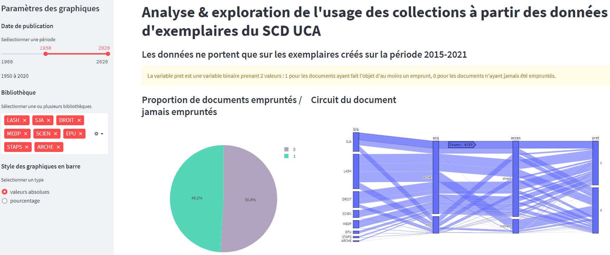

POC de Machine Learning appliqué aux bibliothèques : algorithme de prédiction des prêts et dasboard d'analyse des collections par l'usage
========================================================


## Modèle de ML

### Objectif

Paramétrer un algorithme de ML qui permette de prédire pour un document sa probabilité d'être emprunté (ou pas)

### Problématique et données

Le modèle a été entraîné sur une extraction en csv obtenue à partir du module statistiques Arc du SIGB Aleph 500 (Exlibris), et qui contient tous les exemplaires des collections de monographies de toutes bibliothèques (hors bib associées) entrés dans les collections du SCD entre 2015 et 2021.
Dans le tableau, chaque ligne correspond à un exemplaire, et est décrit par des variables réparties dans chaque colonne. Parmi celles-ci on trouve des identifiants (ppn Sudoc et num bib local), des éléments purement bibliographiques  (titre, date de publication) et des données spécifiques aux exemplaires (bibliothèque, localisation, cote, date d’entrée dans les collections). On dispose également d’une variable “pret” qui est la variable cible, celle que l’on va chercher à prédire et qui correspond à l’étiquette emprunté au moins une fois (le champ contient la date du dernier prêt) / jamais emprunté (le champ est vide).

Il s'agit donc d'une problématique de classification puisqu’il faut affecter une catégorie, une classe, un label (emprunté/pas emprunté) à des observations, par opposition à un problème de régression qui consiste à estimer une variable numérique (un prix par exemple). Plus précisément il s’agit d’une classification binaire puisque la variable cible n’est susceptible de prendre que deux valeurs (qui seront encodées 0/1). De plus nous nous situons dans le cadre d’un apprentissage supervisé, puisque nous connaissons déjà la classe de chaque item dans le dataset et que allons entraîner le modèle sur des données déjà catégorisées, par opposition à des algorithmes non supervisés qui travaillent sur des données sans label pour les classifier “from scratch”.

Les différents jeux de données (données sources et données retraitées) sont dans le dossier /notebooks/data.

### Préparation des données (data processing)

Le code est documenté dans le notebook notebooks/data_processing.ipynb

### Choix de l'algorithme

Les différents algorithmes de classification binaire sont exécutés et évalués dans le notebook notebooks/ml_alogorithmes.ipynb

## Application [Streamlit](https://streamlit.io/) : dashbord d'analyse des collections.

Cette applicaton web reprend les diverses visualisations réalisées durant l'étape de préparation des données.



### Accès

L'application est déployée et accessible sur le PaaS Heroku

[https://azurscd-poc-loan-predict.herokuapp.com/](https://azurscd-poc-loan-predict.herokuapp.com/)

### Installation locale

#### App python

Comme pour toute application Python il est recommandé de créer un environnement virtuel sous lequel installer les packages nécessaires.

```
git clone https://github.com/azur-scd/poc-loan-predict.git
virtualenv YOUR_VENV_NAME
cd YOUR_VENV_NAME/Scripts && activate (Windows)
source YOUR_VENV_NAME/bin/activate (Linux)
pip install -r requirements.txt
streamlit run app.py
```
#### Docker

```
docker build -t <name_image>:<tag_image> .
docker run --name <name_container> -p 8051:8051 <name_image>:<tag_image>

```

    
